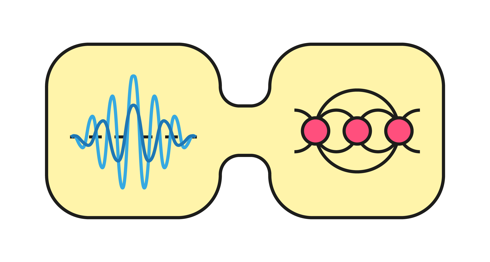

> [!WARNING]
> This package is in early, active development. It is being made public now for
> early community access alongside our arXiv submission (arXiv:XXXX.XXXXX). While 
> intended for broader research use, this is pre-release software. A comprehensive 
> documentation is still pending. Expect breaking changes as the core features are 
> developed.
>
> Please use with caution until the official release.

# NGS: Variational non-Gaussian solutions to interacting spin-boson models

**NGS** is a Julia package designed to study ground-state properties of strongly correlated spin-boson systems. It relies on a hybrid numerical framework that optimizes a non-Gaussian state (NGS) ansatz.

This package implements the method described in the following papers:
>  1. **Variational non-gaussian solutions to interacting spin-boson models**,
> JP Mendonça, Y Wang, and K Jachymski,
> [arXiv link / DOI placeholder] 
> 2. **Role of Matter Interactions in Superradiant Phenomena**,
> JP Mendonça, K Jachymski, Y Wang,
> Physical Review Letters 135 (13), 133601 (2025)

If you use this code in your research, please cite the associated manuscripts (cf. License).

## Overview

The simulation of spin-boson models is often hindered by the infinite-dimensional nature of the bosonic Hilbert space and the presence of strong many-body correlations. Standard approaches typically rely on truncation (limiting photon numbers) or mean-field approximations that neglect entanglement.

This framework addresses these challenges by combining:

1.  **Non-Gaussian Variational Ansatz:**

$$|\psi_{\rm NGS}\rangle = U_{\lambda} \left( U_{\mathrm{GS}} |0\rangle_{\rm b}\otimes|\phi\rangle_{\rm s} \right).$$

The bosonic sector is treated using a variational manifold combining displacement and squeezing, forming a Gaussian state. A (Lang-Firsov-inspired) dressing transformation introduces entanglement between the two subsystems. This replaces explicit photon number truncation.

2.  **Many-Body Solver:** The many-body spin state $|\phi\rangle_{\rm s}$ is obtained, with no further approximations, solving the effective spin Hamiltonian

$$H_{\rm eff} = \langle \psi_{\rm b} | U_\lambda^\dagger H U_\lambda | \psi_{\rm b} \rangle,$$

using Density Matrix Renormalization Group (DMRG) via `ITensors.jl`, capturing spin-spin correlations.

A self-consistent optimization loop then minimizes the variational energy with respect to both the variational parameters and the spin wavefunction, leading to an accurate approximation of the full spin-boson ground state beyond mean-field theory.

## Features

  * **Truncation-free Bosons:** Effectively handles regimes with macroscopic photon occupancy (e.g., superradiance) without convergence issues related to basis size.
  * **Reduced Computational Cost:** The necessary bond-dimension to obtain the ground state is significantly reduced, as the MPS solver only has to deal with an effective spin-only model.
  * **Modular Architecture:** The package is designed to be extensible, strictly separating the physical topology graph from the mathematical variational manifolds (`GS`, `HomogeneousNGS`) and the tensor-network solver backends. 

## Installation

This package is currently provided as a local research package. To use it:

1.  Clone the repository:

    ```bash
    git clone https://github.com/Jpedromend/NGS.git
    cd NGS
    ```

2.  Instantiate the Julia environment:

    ```julia
    using Pkg
    Pkg.activate(".")
    Pkg.instantiate()
    ```

## Usage

Below is a minimal example demonstrating the simulation of the Dicke-Ising Model.

```julia
using NGS
using Printf

# 1. Define the Physics Topology
N = 20
sys = SpinBosonSystem(N)

# Add a single bosonic cavity mode (returns mode index m)
m = add_boson!(sys, 1.0) # omega = 1.0

# Populate local fields and coupling graphs
for i in 1:N
    set_epsilon!(sys, i, 1.0)
    
    # Collective coupling (all spins couple to mode m along X)
    add_spin_boson_coupling!(sys, m, :x, i, 0.8) # g = 0.8
    
    # Nearest-neighbor Ising Z-interaction
    if i < N
        add_spin_coupling!(sys, :z, i, i+1, 2.0) # J = 2.0
    end
end

# 2. Run the Solver (Cold Start)
# The ITensors kwargs (nsweeps, maxdim, cutoff) are piped directly to DMRG.
E0, state_ngs, stats = solve_ngs(sys; 
                                 backend=:dmrg, 
                                 return_stats=true,
                                 nsweeps=100, 
                                 maxdim=[10, 20, 50, 100], 
                                 cutoff=1e-10)

# 3. Calculate Observables using the unified analytical dressing API
avg_n = expect_ngs("n", state_ngs, sys)
sz_sites = expect_ngs("Sz", state_ngs, sys)

mz = sum(sz_sites) / N

@printf("Ground State Energy: %.8f\n", E0)
@printf("Mean Photon Number:  %.4f\n", avg_n)
@printf("Magnetization Mz:    %.4f\n", mz)
println("Converged in $(stats.iterations) iterations.")
```

More examples, including warm-starting workflows for parameter sweeps, can be found in `notebooks/`.

## Repository Structure

  * `src/`: Source code for the library.
      * `NGS.jl`: Main module definition and exports.
      * `types.jl`: Core abstract hierarchy, the `SpinBosonSystem` explicit graph builder, variational manifolds (`GS`, `HomogeneousNGS`), and the unified `NGSState`.
      * `physics.jl`: Implementation of the analytical operator sums, effective Hamiltonian compilation, and energy functionals.
      * `solver.jl`: The self-consistent optimization loops, cold/warm start dispatch logic, and the DMRG backend engine.
      * `observables.jl`: Unified multiple-dispatch functions (`expect_ngs`, `correlation_matrix_ngs`) for exact observables with automatic mathematical dressing.
  * `notebooks/`: Notebook examples for reproducing benchmarks and plotting phase diagrams.
